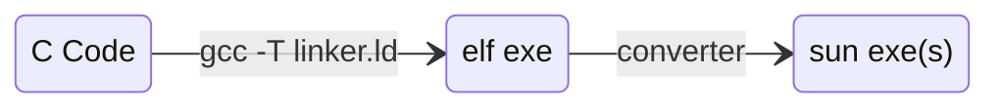

# Binaries

Binaries are the compiled, executable form of programs, containing machine code that the CPU can run directly. They package instructions, data, and metadata like symbol tables or headers. Understanding binaries involves knowledge of formats (like ELF or PE), linking, and how the OS loads and executes them.

## How they work

Most binary files follow a specific format. On UNIX-like systems, this is typically ELF (Executable and Linkable Format) and on ParadiseOS is [SUN](#sun-files). These formats usually organize the binary into sections like code(`.text`), data(`.data`, `.bss`), and metadata like symbol tables or relocation info. Each section has its own purpose. Some are for loading memory at runtime, others are just for debugging.

This is what the typical ELF binary may looks like

```
+------------------+
| ELF Header       | <- Info about the file layout & target architecture
+------------------+
| Program Headers  | <- Used by the loader to map segments into memory
+------------------+
| .text (code)     | <- Executable instructions
+------------------+
| .data (init data)| <- Global/static vars with values
+------------------+
| .bss (zero-init) | <- Global/static vars with no value
+------------------+
| Symbol Tables    | <- Function and variable names
+------------------+
| Relocations      | <- Info for linking/loading
+------------------+
```

When executed, the loader reads the binary, maps it into memory and begins executing at the entry point. This is roughly the same process in ParadiseOS but we construct our binaries differently.

## Sun Files

In ParadiseOS our custom binary format is call SUN. It is roughly the same as all other binaries but the unique thing we do is collapse all binaries into 1 single file.

For example usually a user would have files `tictactoe.out`, `chess.out`, `go.out` all as separate executables then their operating system of choice would allow them to load these binaries in at any moment and begin executing them. Since Paradise does not have a file system we needed a way to have multiple programs defined at once but in a single file. Hence the birth of the SUN file.

SUN would contain (`tictactoe.out`, `chess.out`, and `go.out`) all as a single executable which is packaged into paradise during compile time. Below is the Sun File Format Specification

### The File Format

The max amount of executables is currently 256

| **Field**     | **Bytes** | **Value**                                                        |
|---------------|-----------|------------------------------------------------------------------|
| Magic         | 3         | “SUN”                                                            |
| N             | 1         | Number of executables                                            |
| Table Entries | N * 40    | Table entry for each executable                                  |
| Exe Data      | Unknown   | The data for each executable in the order specified by the table |

### Table Entry

Table Entry defines what executables are in the SUN file and contain their metadata. Table entries are exactly 40 bytes each.

| **Field**    | **Bytes** | **Value**                                            |
|--------------|-----------|------------------------------------------------------|
| Name         | 16        | Null terminated string                               |
| Offset       | 4         | Offset from the start of the file to the executables |
| Entry point  | 4         | Entry point address                                  |
| .text Size   | 4         | Size of the text section                             |
| .rodata Size | 4         | Size of the read-only data section                   |
| .data Size   | 4         | Size of the data section                             |
| .bss Size    | 4         | Size of the bss section in the file                  |

Process Origin is 0x400200

## elf2sun

Since SUN is a custom binary format and we don't write programs from scratch we created elf2sun. elf2sun turns ELF executables into a single SUN executable. The general flow looks like the following



A user begins by writing some C code (without the c standard library but we have [libp!](https://github.com/ParadiseOS/libp)). They then compile this into an ELF executable with a custom linker so we can get the sections we support `.text`, `.data`, etc. After this run our elf2sun converter that dissects the ELF file and constructs the equivalent SUN file. This SUN file is then put in the operating system to be parsed and executed at runtime.

In the main ParadiseOS repository elf2sun is a submodule and you can use the flag `--build_programs` to build all programs defined in the elf2sun subdirectory to run them on the OS.

If you're interested in how elf2sun works you can view the [source code](https://github.com/ParadiseOS/elf2sun)

Last Updated: 7/19/25
